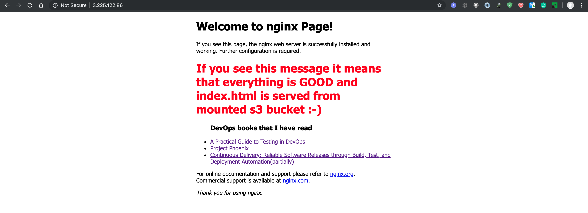

# ЦІЛЬ:
Nginx, serving helloWorld index.html originally stored in S3 bucket.

## AWS РЕСУРСИ, ЩО МОЖУТЬ ТОБІ ЗНАДОБИТИСЯ
### (не абсолютно всі вони, тож обирай, що найбільше підійде саме тобі):
- AWS Auto Scaling Group
- AWS Lambda function
- <s>AWS S3 bucket</s>
- <s>AWS S3 bucket policy</s>
- <s>Amazon AMI image</s>
- EBS volume
- <s>EC2 KeyPair</s>
- <s>EC2 instance</s>
- <s>IAM policy</s>
- <s>IAM role</s>
- <s>IAM user</s>

### ДОДАТКОВІ ВИМОГИ:
- <s>index.html should survive shutdown/startup cycle</s>
- <s>Nginx can be either pre-installed or setup during startup</s>
- <s>Solution should be consistent and reproducible (no manual steps)</s>

### Тобі залишається написати свій солюшн, щоб досягти цілі :)

### Packer command
```
brew install packer (For macOS)
cd packer
packer validate nginx_ami.json
packer build -only amazon-ebs nginx_ami.json
packer build -only docker nginx_ami.json 2>&1 | tee packer.log
```
### Terraform command
```
cd terraform
terraform init
export TF_LOG=INFO
export TF_LOG_PATH="./logs"
terraform plan
```

You cant setup variables in my_env.tfvars file...
```
terraform apply  -var-file=my_env.tfvars
```

Or you can set it during the net Terraform run
```
terraform apply
```

# Expected result




### Useful links

1. Terraform AWS manual
https://www.terraform.io/docs/providers/aws/

2. INTRODUCTION TO TERRAFORM WITH AWS ELB & NGINX
https://www.bogotobogo.com/DevOps/Terraform/Terraform-Introduction-AWS-elb-nginx.php

3. https://davidburgos.blog/nginx-to-serve-statics-from-amazon-s3/

4. https://medium.com/@hmalgewatta/setting-up-an-aws-ec2-instance-with-ssh-access-using-terraform-c336c812322f

5. https://github.com/gruntwork-io/terratest/tree/master/examples/terraform-remote-exec-example

6. https://www.digitalocean.com/community/tutorials/how-to-set-up-nginx-virtual-hosts-server-blocks-on-ubuntu-12-04-lts--3